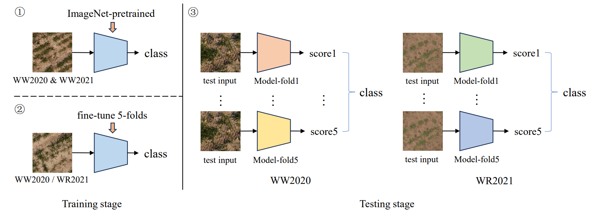

## Second place solution of the ICCV/CVPPA 2023 Deep Nutrient Deficiency challenge

We present a holistic approach for high resolution image classification that won second place in the [ICCV/CVPPA2023 Deep Nutrient Deficiency Challenge](https://cvppa2023.github.io/challenges/#deep-nutrient-deficiency---dikopshof---winter-wheat-and-winter-rye). The approach consists of a full pipeline of: 1) data distribution analysis to check potential domain shift, 2) backbone selection for a strong baseline model that scales up for high resolution input, 3) transfer learning that utilizes published pretrained models and continuous fine-tuning on small sub-datasets, 4) data augmentation for the diversity of training data and to prevent overfitting, 5) test-time augmentation to improve the prediction's robustness, and 6) "data soups" that conducts cross-fold model prediction average for smoothened final test results.



This repository is based on [mmpretrain](https://github.com/open-mmlab/mmpretrain) toolbox. A detailed technical report is available [here](https://arxiv.org/abs/2309.15277).

### Dataset preparation
Download the datasets WW2020 and WR2021 based on https://github.com/jh-yi/DND-Diko-WWWR. Then split each subset into 5 folds, and organize the data as below:
```
data/cvppa2023_cls/
    ├── WW2020/
        ├── images/
            ├── 20200422_0.jpg
            └── ...
        ├── train_fold1.txt
        ├── ...
        ├── train_fold5.txt
        ├── val_fold1.txt
        ├── ...
        ├── val_fold5.txt
        └── test.txt
    ├── WW2021/
        ...
    └── WW2020_WR2021/
        ├── images/
        └── train_all.txt
```

### Model preparation
We use Swin-V2 as the general model, in general following https://github.com/open-mmlab/mmpretrain/tree/main/configs/swin_transformer_v2 to prepare the config files. This includes:
- `configs/_base_/datasets/cvppa2023_cls_*.py`
- `configs/swin_transformer_v2/swinv2-base-w24_in21k-pre_4xb2_cvppa2023_cls*.py`
Also, download ImageNet pretrained weights from [here](https://download.openmmlab.com/mmclassification/v0/swin-v2/swinv2-base-w24_in21k-pre_3rdparty_in1k-384px_20220803-44eb70f8.pth) and put it into `pretrained_weights`.

### Train
In a server with 4 GPUs, run
```
bash tools/dist_train.sh configs/swin_transformer_v2/swinv2-base-w24_in21k-pre_4xb2_cvppa2023_cls_[TASK].py works_dirs/swinv2-base-w24_in21k-pre_4xb2_cvppa2023_cls_[TASK] 4
```
Step by step, `[TASK]` represents:
- `ww2020_wr2021-1024px` (train all data with ImageNet pretrained weights)
- `ww2020_fold1-1024px`, ..., `ww2020_fold5-1024px` (continuous fine tuning WW2020)
- `wr2021_fold1-1024px`, ..., `wr2021_fold5-1024px` (continuous fine tuning WR2021)

### Test
Run inference for each fine-tuned fold for each subset with test-time-augmentation:
```
bash tools/dist_test.sh configs/swin_transformer_v2/swinv2-base-w24_in21k-pre_4xb2_cvppa2023_cls_[TASK].py works_dirs/swinv2-base-w24_in21k-pre_4xb2_cvppa2023_cls_[TASK]/epoch_49.pth 4 --tta --out work_dirs/cvppa2023_cls_pred/[TASK].pkl
```
where `[TASK]` represents `ww2020_fold1-1024px`, ..., `ww2020_fold5-1024px`, `wr2021_fold1-1024px`, ..., `wr2021_fold5-1024px`.

Then, ensemble predictions through "data soups" for final test results:
```
python tools/cvppa_data_soup.py --pred-dir PKL_DIR --pred-fnames PRED_FNAMES --out-path OUTPUT_TXT_PATH
```

### Citation
```bibtex
@misc{wang2023boosting,
      title={Boosting High Resolution Image Classification with Scaling-up Transformers}, 
      author={Yi Wang},
      year={2023},
      eprint={2309.15277},
      archivePrefix={arXiv},
      primaryClass={cs.CV}
}
```
